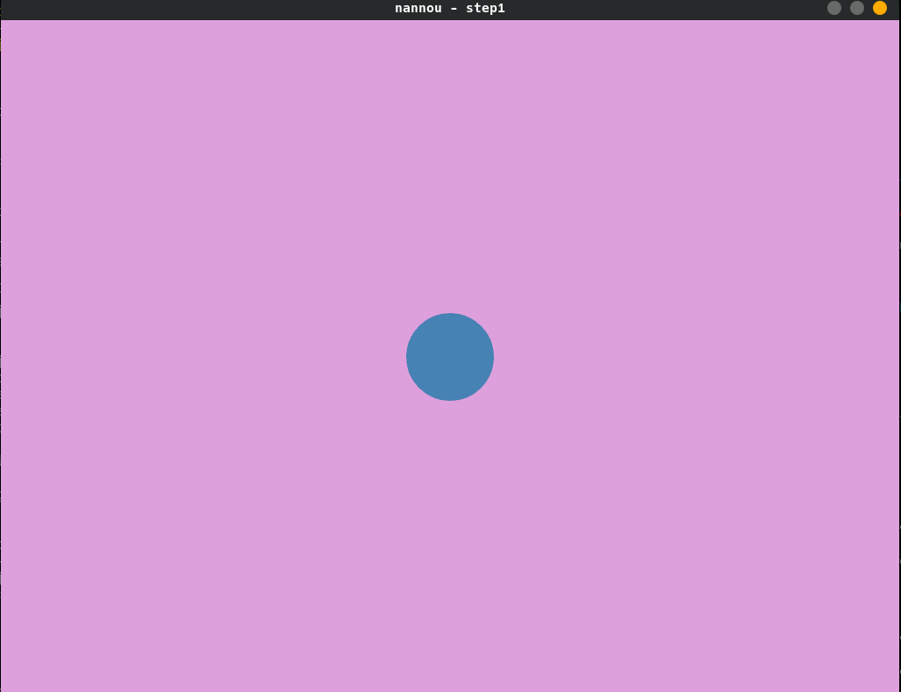
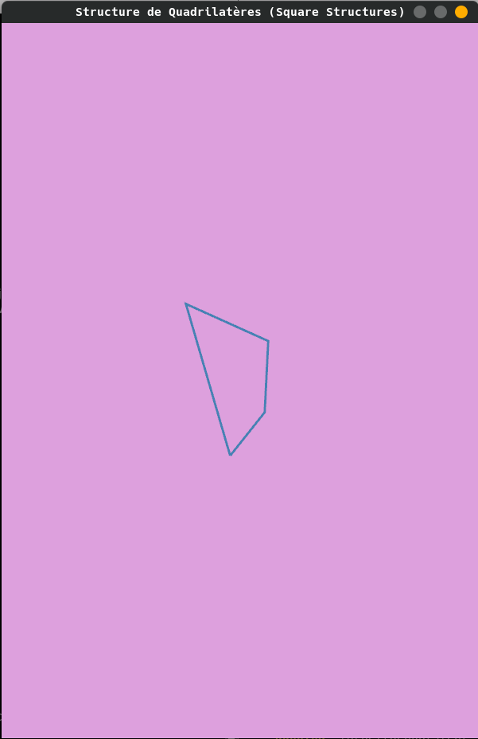
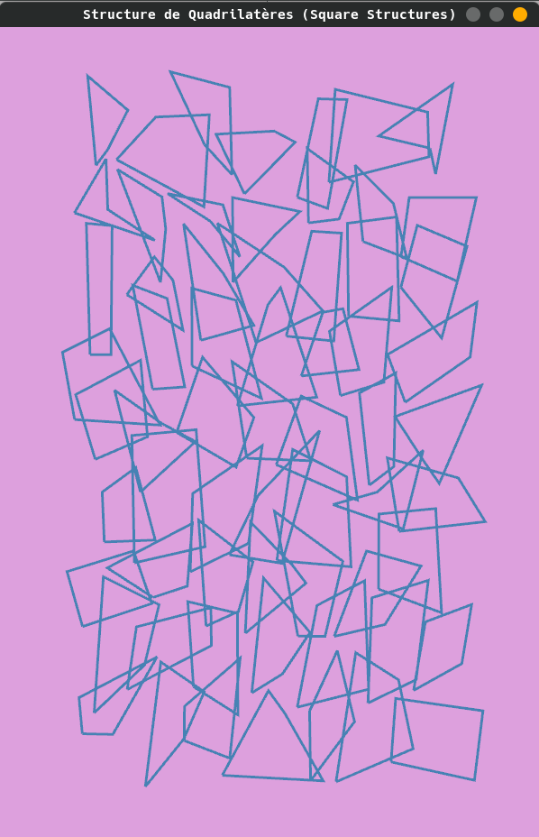
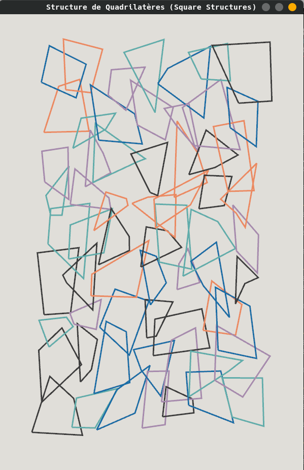
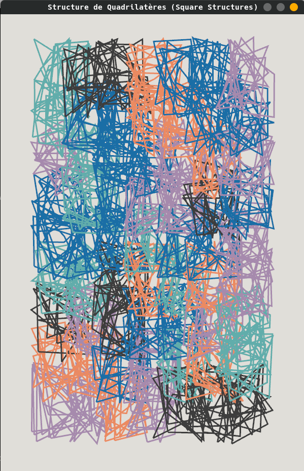
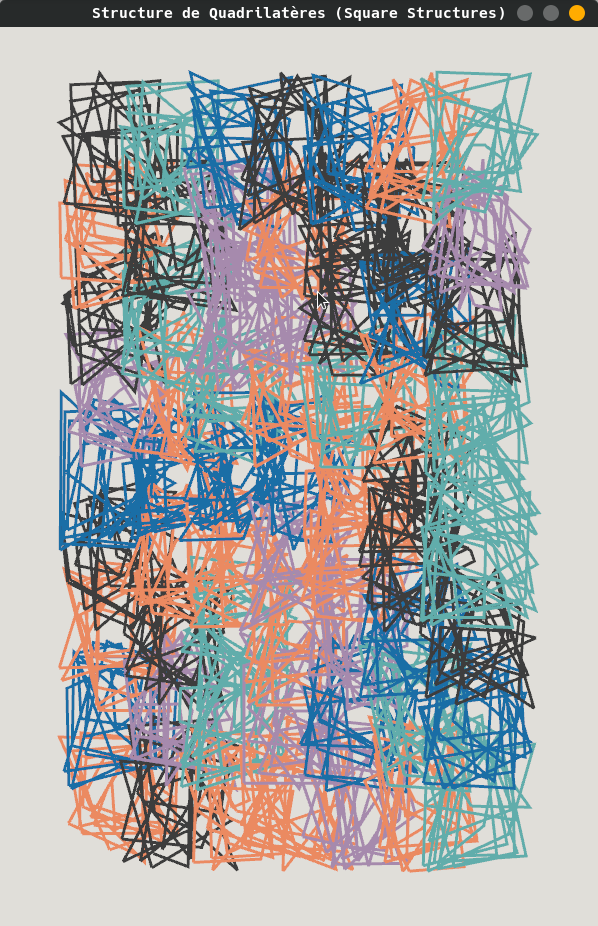

# Square Structures

Inspired by Vera Molnar's Structure de Quadrilatères (Square Structures)
https://emuseum.mfah.org/objects/139838/structure-de-quadrilateres-square-structures

Code based on Processing sketch seen here
https://www.youtube.com/watch?v=O5G4SoWBoao


## Running

Run the final result with

```
cargo run -p square_structures
```

or run an individual step with (where <n> is the number of the step, eg 1)

```
cargo run -p square_structures --bin step<n>
```

You can exit the window with `esc`.


## Steps

### Step 1



This is the default [app template](https://github.com/nannou-org/nannou/tree/master/examples/template) taken from the nannou examples repository.

Note the naming of the functions and how they relate to the Model View Controller pattern.

We'll remove the circle and draw a quad with the `polyline` function.

Let's define a size of the window and name it.

```rust
// somewhere at the top

const WIN_W:u32 = 600;
const WIN_H:u32 = 900;


// in fn model()

let _window = app.new_window()
        .title("Structure de Quadrilatères (Square Structures)") // new
        .size(WIN_W, WIN_H) // new
        .view(view)
        .build()
        .unwrap();

```

Remove the circle and draw a rectangle using polyline.

```rust
// in fn view()

draw.polyline()
        .x_y(0.0, 0.0)
        .color(STEELBLUE)
        .weight(3.0)
        .points(vec!(pt2(-10.0, -10.0),
                     pt2(10.0, -10.0),
                     pt2(10.0, 10.),
                     pt2(-10.0, 10.0),
                     pt2(-10.0, -10.0))); // last point == as 1st point to close!
```

Great! Let's make the points (and the rectangle) random!

```rust

    let w = 100.0;
    let h = 100.0;

    let mut points = vec!();
    let point1 = pt2((random_f32()) * -w, (random_f32()) * -h);
    points.push(point1);
    points.push(pt2((random_f32()) * w, (random_f32()) * -h));
    points.push(pt2((random_f32()) * w, (random_f32()) * h));
    points.push(pt2((random_f32()) * -w, (random_f32()) * h));
    points.push(point1);


```

Hmmm, now the rectangle gets new points on every frame. Not what we want right now. We want to define the points once at the start.

``` rust

struct Model {
    _window: window::Id,
    points: Vec<Vector2> // adding this
}

// in fn model()


    let w = 100.0;
    let h = 100.0;

    let mut points = vec!();
    let point1 = pt2((random_f32()) * -w, (random_f32()) * -h);
    points.push(point1);
    points.push(pt2((random_f32()) * w, (random_f32()) * -h));
    points.push(pt2((random_f32()) * w, (random_f32()) * h));
    points.push(pt2((random_f32()) * -w, (random_f32()) * h));
    points.push(point1);

    Model { _window,
             points }

//

fn view(app: &App, model: &Model, frame: Frame) {
    let draw = app.draw();
    draw.background().color(PLUM);
    draw.polyline()
        .x_y(0.0, 0.0)
        .color(STEELBLUE)
        .weight(3.0)
        .points(model.points.clone());

    draw.to_frame(app, &frame).unwrap();
}

```

The `Model` struct acts as our state through the application, the `model` function as the setup function known from other frameworks.

Looking good!


## Step 2



We now draw random rectangle at the start, let's draw a grid of them!

Let's add some abstraction and create a representation of the thing we want a grid of, I called it a `SquareStructure` and at first it will hold a position (in the grid) and the points we need for the polyline.

``` rust

struct SquareStructure {
    position: Vector2,
    points: Vec<Vector2>
}

```

Then we can update the `Model` struct and the `model` function to use the SquareStructure.

``` rust

struct Model {
    _window: window::Id,
    square_structures: Vec<SquareStructure> // this is new
}


// this goes in fn model()

    let square_structures = gen_structures();

    Model { _window,
             square_structures }

```

Where does the `gen_structures` function come from? We'll write it next! That's where I want to generate the grid!

``` rust
// at the top we'll define our rows and columns

const NUM_X:i32 = 7;
const NUM_Y:i32 = 9;

// and then

fn gen_structures() -> Vec<SquareStructure> {
    let mut sqrs = vec!();
    for i in 0..NUM_X {
        for j in 0..NUM_Y {
            let q = SquareStructure::new(i as f32, j as f32);
            sqrs.push(q);
        }
    }
    sqrs
}

```

`SquareStructure::new` doesn't exist yet, but now we now what we want and need: a function to take the positions and the grid and calculate the x and y values in the window from it! The points part we can copy reuse from the old `model` function and we can also put the width and height values of the squares into constants at the top.


``` rust

// at the top

const SQUARE_W:f32 = 60.0;
const SQUARE_H:f32 = 80.0;

// and then

impl SquareStructure {
    pub fn new(i_x: f32, i_y: f32) -> Self {
        let w = SQUARE_W;
        let h = SQUARE_H;

        let x = i_x * w;
        let y = i_y * h;

        let position = vec2(x, y);

        let mut points = vec!();
        let point1 = pt2((random_f32()) * -w, (random_f32()) * -h);
        points.push(point1);
        points.push(pt2((random_f32()) * w, (random_f32()) * -h));
        points.push(pt2((random_f32()) * w, (random_f32()) * h));
        points.push(pt2((random_f32()) * -w, (random_f32()) * h));
        points.push(point1);

        SquareStructure {
            position,
            points
        }
    }
}

```

And then, of course, we need to draw it!

``` rust

// in view

    for structure in model.square_structures.iter() {
        draw.polyline()
            .xy(structure.position)
            .color(STEELBLUE)
            .weight(3.0)
            .points(structure.points.iter().cloned());
    }


```

When you run the app now, you'll see the grid we drew is off-center, which makes sense, since the center of nannou's window is the origin of the coordinate system. But we can easily fix that by offsetting the coordinates.

``` rust

// in SquareStructure::new

    let max_x = WIN_W as f32;
    let max_y = WIN_H as f32;

    let x = i_x * w;
    let y = i_y * h;
    let x = x - (max_x * 0.3);
    let y = y - (max_y * 0.35);

```


## Step 3



Let's adjust the colors next. We'll add color to our SquareStructure and assign pick a random color from a predefined selection of colors. We'll use the rand crate for that.

``` rust

// at the very top

use rand::seq::SliceRandom;
use nannou::color;

// and then

struct SquareStructure {
    position: Vector2,
    collection: Vec<Square>,
    color: color::Rgb // this is new
}

// then in SquareStructure::new

    pub fn rando_color() -> color::Rgb {
        let colors = vec!(
            rgb(0.38, 0.68, 0.67), // green
            rgb(0.1, 0.43, 0.65), // blue
            rgb(0.65, 0.54, 0.68), // purple
            rgb(0.92, 0.54, 0.38), // orange
            rgb(0.24, 0.24, 0.24) // black
        );
        let color = colors.choose(&mut rand::thread_rng()).unwrap();
        *color
    }

```

And then we use each color to draw.

``` rust

// in view

    draw.background().rgb(0.88, 0.87, 0.85);  // this is different

    for structure in model.square_structures.iter() {
        draw.polyline()
            .xy(structure.position)
            .color(structure.color) // and this
            .weight(3.0)
            .points(structure.points.iter().cloned());
    }

```

Boom!

## Step 4



Now for each position, we want to draw multiple rectangles and not only one.

Let's first declare how many rectangles we want up front and then abstract the collection of points in `SquareStructure` into `Square`. Then we can have multiple squares per structure and the structure holds the grid position and color. Nice!

``` rust

// at the top
const MAX_NUM_SQUARES:usize = 10;

// and then

struct Square {
    points: Vec<Vector2>
}

impl Square {
    pub fn new(w:f32, h:f32) -> Self {
        let mut points = vec!();
        let point1 = pt2((random_f32()) * -w, (random_f32()) * -h);
        points.push(point1);
        points.push(pt2((random_f32()) * w, (random_f32()) * -h));
        points.push(pt2((random_f32()) * w, (random_f32()) * h));
        points.push(pt2((random_f32()) * -w, (random_f32()) * h));
        points.push(point1);
        Square {
            points
        }
    }
}
```

Let's update the `SquareStructure` struct, too.

``` rust

struct SquareStructure {
    position: Vector2,
    collection: Vec<Square>, // this is different
    color: color::Rgb
}

// in SquareStructure::new

        let collection = (0..MAX_NUM_SQUARES).into_iter()
            .map(|_| Square::new(w, h))
            .collect();

        SquareStructure {
            position,
            collection,
            color: SquareStructure::rando_color()
        }
```

And then we draw it!

``` rust

    for structure in model.square_structures.iter() {
        for square in structure.collection.iter() {
            draw.polyline()
                .xy(structure.position)
                .color(structure.color)
                .weight(3.0)
                .points(square.points.iter().cloned());
        }
    }
```

Yay, pretty close I'd say!

## Step 5



Finally, let's start playing around with what we have!

I want some interaction with a three button mouse:

- Left click assigns new square positions

- Right click assigns new colors

- Scrolling up or down in- or decreases the number of drawn squares per structure


First, let's setup our event functions! We can get the function signatures from the documentation.

``` rust

// in fn model()

    app.new_window()
        .title("Structure de Quadrilatères (Square Structures)")
        .size(WIN_W, WIN_H)
        .mouse_released(mouse_released) // new
        .mouse_wheel(mouse_wheel) // new
        .view(view)
        .build()
        .unwrap();

// and then


fn mouse_released(_app: &App, model: &mut Model, _button: MouseButton) {}

fn mouse_wheel(_app: &App, model: &mut Model, _dt: MouseScrollDelta, _phase: TouchPhase) {}

```

For the `mouse_released` event, we can match on the `button` and then either update the points or the color of our squares.

``` rust
fn mouse_released(_app: &App, model: &mut Model, button: MouseButton) {
    match button {
        MouseButton::Left => {
            for structure in model.square_structures.iter_mut() {
                structure.set_points();
            }
        },
        MouseButton::Right => {
            for structure in model.square_structures.iter_mut() {
                structure.set_color();
            }
        },
        _ => {}
    }
}
```

And of course we can then implement these functions.

``` rust

// in impl SquareStructure

    pub fn set_points(&mut self) {
        self.collection = (0..MAX_NUM_SQUARES).into_iter()
            .map(|_| Square::new())
            .collect();
    }
    pub fn set_color(&mut self) {
        self.color = SquareStructure::rando_color();
    }

```

For the number of rectangles per structure, I'd add that as a global value to our model and manipulate it from there.

``` rust

struct Model {
    _window: window::Id,
    square_structures: Vec<SquareStructure>,
    current_num_squares: usize // new
}


// in fn model()

    Model { _window,
             square_structures,
             current_num_squares: MAX_NUM_SQUARES }

```

And when we draw everything, we only draw the amount given in the model.

``` rust

// in fn view()

for square in structure.collection.iter().take(model.current_num_squares) { // only the .take is new
 // leaving out the rest
}

```

And finally the `mouse_wheel` function where we match on dt (delta) that is either -1 or 1 depending on scroll direction.

``` rust

fn mouse_wheel(_app: &App, model: &mut Model, dt: MouseScrollDelta, _phase: TouchPhase) {
    match dt {
        MouseScrollDelta::LineDelta(_, y) if y > 0.0 => {
            if model.current_num_squares < MAX_NUM_SQUARES {
                model.current_num_squares += 1;
            }
        },
        MouseScrollDelta::LineDelta(_, y) if y < 0.0 => {
            if model.current_num_squares > 1 {
                model.current_num_squares -= 1;
            }
        },
        _ => {}
    }
}

```

Nice! And with this we're done!


## Step 6



We can still do some cleanup. For example we don't need the `update` function at all in our case and our `Model` does not need to hold the window.

But you can get creative now and maybe you may need these for some of your ideas?
